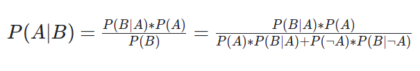
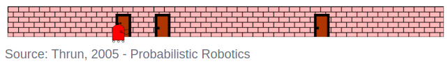

# 1D Bayes Filter MCL in C++
## Bayes Filtering
The powerful Monte Carlo localization algorithm estimates the posterior distribution of a robot’s position and orientation based on sensory information. This process is known as a recursive **Bayes filter**.  

Using a Bayes filtering approach, roboticists can estimate the **state** of a **dynamical system** from **sensor measurements**.  

The goal of Bayes filtering is to estimate a probability density over the state space conditioned on the measurements.

## Probability
Given a set of probabilities, **P(A|B)** is calculated as follows:  

## Challenge
  
This robot is located inside of a 1D hallway which has three doors. The robot doesn't know where it is located in this hallway, but it has sensors onboard that can tell it, with some amount of precision, whether it is standing in front of a door, or in front of a wall. The robot also has the ability to move around - with some precision provided by its odometry data. Neither the sensors nor the movement is perfectly accurate, but the robot aims to locate itself in this hallway.  

The mobile robot is now moving in the 1D hallway and collecting odometry and perception data. With the odometry data, the robot is keeping track of its current position. Whereas, with the perception data, the robot is identifying the presence of doors.  

In this quiz, we are aiming to calculate the state of the robot, given its measurements. This is known by the belief: **P(Xt|Z)**!

**Given**:

- **P(POS)**: The probability of the robot being at the actual position
- **P(DOOR|POS)**: The probability of the robot seeing the door given that it’s in the actual position
- **P(DOOR|¬POS)**: The probability of the robot seeing the door given that it’s not in the actual position

**Compute**:

- **P(POS|DOOR)**: The belief or the probability of the robot being at the actual position given that it’s seeing the door.
